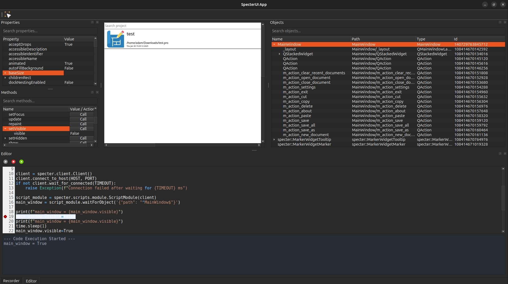

<a id="readme-top"></a>

[![Contributors][contributors-shield]][contributors-url]
[![Forks][forks-shield]][forks-url]
[![Stargazers][stars-shield]][stars-url]
[![Issues][issues-shield]][issues-url]
[![project_license][license-shield]][license-url]

<!-- PROJECT LOGO -->
<br />
<div align="center">
  <a href="https://github.com/AdamMinge/specter_client">
    
  </a>

<h3 align="center">Specter Viewer</h3>

  <p align="center">
    Specter Viewer is a PySide6-based GUI application for visual inspection, object hierarchy browsing, property editing, method invocation, and test authoring. Acts as the visual control center for live applications.
    </br>
    </br>
    <a href="https://github.com/AdamMinge/specter_client"><strong>Explore the docs »</strong></a>
    <br />
    <br />
    <a href="https://github.com/AdamMinge/specter_client">View Demo</a>
    &middot;
    <a href="https://github.com/AdamMinge/specter_client/issues/new?labels=bug&template=bug-report---.md">Report Bug</a>
    &middot;
    <a href="https://github.com/AdamMinge/specter_client/issues/new?labels=enhancement&template=feature-request---.md">Request Feature</a>
  </p>
</div>

<!-- TABLE OF CONTENTS -->
<details>
  <summary>Table of Contents</summary>
  <ol>
    <li><a href="#roadmap">Roadmap</a></li>
    <li><a href="#contact">Contact</a></li>
    <li><a href="#about">About</a></li>
  </ol>
</details>

<!-- ABOUT -->
## About



### Properties (Top-Left)

Displays the selected object’s properties.
Properties shows current values such as visible, enabled, or geometry attributes. You can edit values directly.

### Methods (Top-Left)

Displays the selected object’s methods. 
Methods Lists callable actions like setVisible, update, or repaint.
You can invoke methods by clicking their corresponding buttons.

### Objects (Top-Right)

Hierarchical view of all discovered objects in the target application.
- Name: Object name in the UI hierarchy (e.g., MainWindow, QAction).
- Path: Full object path in the widget tree.
- Type: Class type (e.g., QAction, QStackedWidget).
- Id: Internal object ID.

Clicking an object set current object, which is use to present properties, methods, view.

### Viewer (Central)

Live Preview of the currently selected object.
- Displays the real-time rendered image of the widget or control.
- Updates continuously as the object changes in the target application.
- Useful for confirming visual state changes (e.g., hidden/visible, resized, text updated).

### Editor (Bottom)

Interactive Python scripting area connected to the Specter API.
- Execute scripts against the target application in real-time.
- Output and exceptions are shown directly under the script area.
- Example: connect to client and change visibility of the main window:

```py
import specter
import time

from PySide6.QtNetwork import QHostAddress

TIMEOUT=5
HOST = QHostAddress("127.0.0.1")
PORT = 5010

client = specter.client.Client()
client.connect_to_host(HOST, PORT)
if not client.wait_for_connected(TIMEOUT):
    raise Exception(f"Connection failed after waiting for {TIMEOUT} ms")
    
script_module = specter.scripts.module.ScriptModule(client)
main_window = script_module.waitForObject('{"path": "^MainWindow$"}')

print(f"main_window = {main_window.visible}")
main_window.visible=False
print(f"main_window = {main_window.visible}")
main_window.visible=True
print(f"main_window = {main_window.visible}")
```

<p align="right">(<a href="#readme-top">back to top</a>)</p>

<!-- ROADMAP -->
## Roadmap

- [ ] Improved code editor highlighting
- [ ] Improved recording widget 

See the [open issues](https://github.com/AdamMinge/specter_client/issues) for a full list of proposed features (and known issues).

<p align="right">(<a href="#readme-top">back to top</a>)</p>

<!-- CONTACT -->
## Contact

Adam Minge - minge.adam@gmail.com

Project Link: [https://github.com/AdamMinge/specter_client](https://github.com/AdamMinge/specter_client)

<p align="right">(<a href="#readme-top">back to top</a>)</p>

<!-- MARKDOWN LINKS & IMAGES -->
<!-- https://www.markdownguide.org/basic-syntax/#reference-style-links -->
[contributors-shield]: https://img.shields.io/github/contributors/AdamMinge/specter_client.svg?style=for-the-badge
[contributors-url]: https://github.com/AdamMinge/specter_client/graphs/contributors
[forks-shield]: https://img.shields.io/github/forks/AdamMinge/specter_client.svg?style=for-the-badge
[forks-url]: https://github.com/AdamMinge/specter_client/network/members
[stars-shield]: https://img.shields.io/github/stars/AdamMinge/specter_client.svg?style=for-the-badge
[stars-url]: https://github.com/AdamMinge/specter_client/stargazers
[issues-shield]: https://img.shields.io/github/issues/AdamMinge/specter_client.svg?style=for-the-badge
[issues-url]: https://github.com/AdamMinge/specter_client/issues
[license-shield]: https://img.shields.io/github/license/AdamMinge/specter_client.svg?style=for-the-badge
[license-url]: https://github.com/AdamMinge/specter_client/blob/master/LICENSE.txt
[Python]: https://img.shields.io/badge/Python-3.12-blue?logo=python&logoColor=white
[Python-url]: https://www.python.org/
[Poetry]: https://img.shields.io/badge/Poetry-1.8+-blueviolet?logo=python&logoColor=white
[Poetry-url]: https://python-poetry.org/
[PySide6]: https://img.shields.io/badge/PySide6-6.9+-green?logo=qt&logoColor=white
[PySide6-url]: https://doc.qt.io/qtforpython-6/index.html